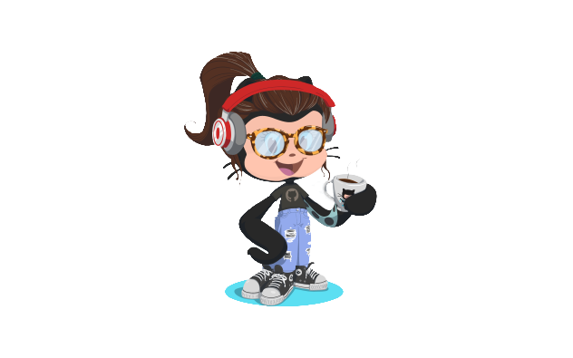

# Olá! Bem vinda e Bem vindo ao meu perfil 🤙🏼

## 🚀 Um pouco sobre mim:
🎓 Bacharel em Serviço Social  
💻 Desenvolvedora Front-end  
🎯 Meta: Garantir direitos, impactar pessoas e provocar transformações sociais através da tecnologia  
🐶 tenho um cachorro chamado if

### 🤓 Vamos trocar figurinhas?

### 👩‍💻 Habilidades Técnicas

 

